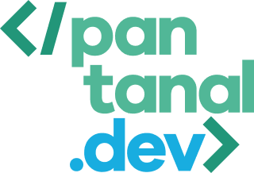
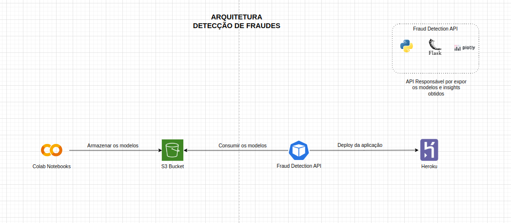

# API Detecção de Fraudes


### Descrição
API Front-End como um painel de visualização dos padrões e das análises dos dados.



### Ambiente Python3
```bash
python3 -m venv venv
source ./venv/bin/activate
python3 -m pip install --upgrade pip
python3 -m pip install -r requirements.txt
```


### Como rodar localmente
1. Configure as credencias de acesso na AWS para obter um usuário com permissões de acesso ao S3 Bucket - [Tutorial](https://docs.aws.amazon.com/IAM/latest/UserGuide/security-creds.html).

2. Acesse o repositório [Notebooks - Detecção de Fraudes](https://github.com/Time-Jaguatirica/fraud-detection-notebooks).

3. Entre no **Demo Day.ipynb** na seção **3. Desafio - Aplicando o modelo** e utilize a função para subir o modelo:
```python
import pickle

bucket = 'fraud-detection-models'

def save_model_to_s3(trained_model, model_name):
model_name = f"{model_name}.pkl"
pickle.dump(trained_model, open(model_name, 'wb'))
upload_file(model_name, bucket)

save_model_to_s3(best_rf, 'random-forest-model')
```

4. Organize as pastas do S3 nessa estrutura:
```tree
.
├── fraud-detection-models
│   ├── model-1-example.pkl
│   ├── model-2-example.pkl
│   └── model-3-example.pkl
```

5. Criar um arquivo *.env* similar ao *.env.example* com as credencias obtidas acima.

6. Maneiras de colocar a aplicação no ar:
- Rodando somente o Flask:
```bash
python3 app.py
```

- Utilizando servidor local:
```bash
gunicorn app:server --bind 0.0.0.0:8000
```

- Utilizando docker compose:
```bash
docker compose up
```


### Referências
- [AWS Credentials](https://docs.aws.amazon.com/IAM/latest/UserGuide/security-creds.html)
- [Real Python](https://realpython.com/python-dash/)
- [Health Check](https://howchoo.com/devops/how-to-add-a-health-check-to-your-docker-container)
